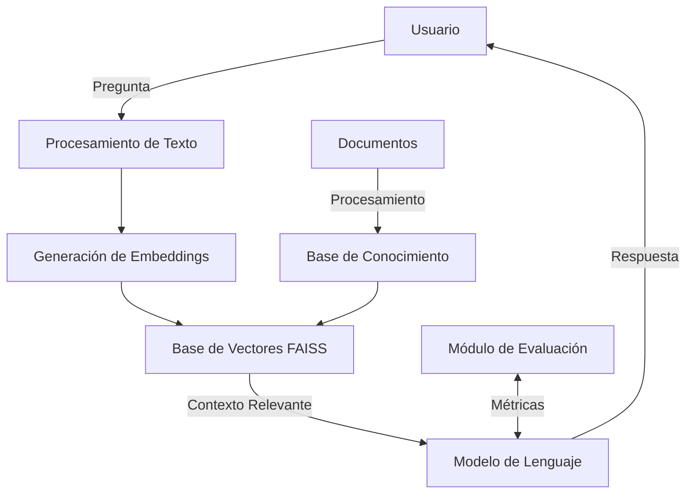

# 📚 Sistema RAG para Control de Calidad del Conocimiento Interno

<div align="center">
  
  
  
  
</div>

👨‍💻 **Autor**: Ronald Castillo Capino  
📧 **Contacto**: [ron.h.castillo@gmail.com](mailto:ron.h.castillo@gmail.com)

> 💡 Este proyecto implementa un sistema avanzado de Preguntas y Respuestas (Q&A) que combina recuperación de información con generación de lenguaje natural, garantizando respuestas precisas, verificables y basadas en documentos específicos.

## 🚀 Descripción del Proyecto

Este sistema **RAG (Retrieval-Augmented Generation)** está diseñado para proporcionar respuestas precisas y contextualizadas mediante la combinación de:

- 🔍 **Recuperación de información** avanzada de documentos técnicos
- 🧠 **Generación de respuestas** utilizando el modelo local `Llama-3.1-Nemotron-Nano-4B-v1.1` con aceleración por GPU
- 📊 **Evaluación automática** de la calidad con métricas RAGAS
- 🚀 **Aceleración por GPU** para un rendimiento óptimo en inferencia local

💡 **Caso de Uso Principal**: Sistema experto de preguntas y respuestas sobre el libro "An Introduction to Statistical Learning with Applications in Python", permitiendo a los usuarios obtener explicaciones claras y precisas sobre conceptos de aprendizaje estadístico.

### 🚀 Desempeño con Aceleración por GPU

El sistema está optimizado para aprovechar al máximo la capacidad de procesamiento en paralelo de tu GPU local, ofreciendo tiempos de respuesta rápidos con el modelo Llama-3.1-Nemotron-Nano-8B. La configuración incluye:

- **Contexto extendido**: 16,384 tokens
- **Capas GPU**: 30 capas (ajustable según VRAM)
- **Procesamiento por lotes**: 512 tokens
- **Hilos de CPU**: 8 hilos

### 🔧 Requisitos de Hardware

| Componente | Mínimo | Recomendado |
|------------|--------|-------------|
| **GPU** | NVIDIA RTX 3060 | NVIDIA RTX 4090 o superior |
| **VRAM** | 12GB | 24GB+ |
| **RAM del Sistema** | 32GB | 64GB+ |
| **Almacenamiento** | 15GB libres | SSD NVMe |

### ⚙️ Configuración Óptima

1. **Controladores NVIDIA**
   ```bash
   # Verificar instalación de controladores
   nvidia-smi
   # Versión mínima recomendada: 525.60.13
   ```

2. **Bibliotecas CUDA**
   - CUDA Toolkit 11.7 o superior
   - cuDNN 8.5 o superior
   - Verificar instalación:
     ```bash
     nvcc --version
     ```

### 🚀 Optimizaciones Implementadas

- **Inferencia Acelerada por GPU**
  - Todas las operaciones del modelo se ejecutan en la GPU
  - Soporte para CUDA y cuBLAS para operaciones matriciales

- **Gestión Eficiente de Memoria**
  - Carga selectiva de capas del modelo
  - Optimización de memoria intermedia
  - Soporte para precisión mixta (FP16/FP32)

- **Procesamiento por Lotes**
  - Procesamiento paralelo de múltiples consultas
  - Ajuste automático del tamaño de lote según la VRAM disponible

### 📊 Rendimiento Esperado

| Configuración | Tokens/seg | Memoria GPU |
|---------------|------------|-------------|
| RTX 3060 (12GB) | 18-25 | ~12GB |
| RTX 3090 (24GB) | 30-40 | ~22GB |
| RTX 4090 (24GB) | 45-60 | ~24GB |

*Nota: El rendimiento puede variar según la carga del sistema y la configuración específica.*

### Características Clave

- ✅ **Respuestas Basadas en Contexto**: Cada respuesta está respaldada por fragmentos específicos del documento
- 🔍 **Búsqueda Semántica**: Encuentra información relevante incluso con consultas en lenguaje natural
- 📈 **Evaluación Continua**: Sistema integrado para medir y mejorar la calidad de las respuestas
- 🚀 **Rendimiento Optimizado**: Diseñado para funcionar eficientemente en hardware estándar

## 🎯 Objetivo

Desarrollar un asistente de IA que:

✅ Proporcione respuestas precisas basadas en documentos específicos  
✅ Mantenga la trazabilidad de las fuentes de información  
✅ Evalúe automáticamente la calidad de las respuestas  
✅ Sea fácil de implementar y mantener

## 🏗️ Arquitectura del Sistema



### 🔧 Componentes Principales

#### 1. **Procesamiento de Documentos**
- **Extracción de Texto**: Utiliza PyPDF2 para extraer texto de documentos PDF
- **Limpieza de Texto**: Eliminación de caracteres especiales, normalización de espacios
- **Tokenización**: División del texto en unidades significativas
- **Fragmentación Semántica**:
  - Tamaño de fragmento: 4000 caracteres
  - Solapamiento: 200 caracteres
  - Preservación de contexto entre fragmentos

#### 2. **Modelo de Embeddings**
- **Modelo**: `sentence-transformers/all-MiniLM-L6-v2`
- **Dimensión de Embeddings**: 384
- **Normalización**: Vectores unitarios para similitud coseno
- **Rendimiento**: Optimizado para equilibrio entre precisión y velocidad

#### 3. **Almacenamiento Vectorial (FAISS)**
- **Índice**: `IndexFlatL2` para búsqueda exacta
- **Métricas**: Distancia euclidiana (L2)
- **Optimizaciones**:
  - Búsqueda por lotes
  - Filtrado por umbral de similitud
  - Recuperación de los 5 mejores resultados

#### 4. **Modelo de Lenguaje Local**
- **Modelo Base**: `Llama-3.1-Nemotron-Nano-8B-v1`
- **Ejecución**:
  - Ejecutado localmente a través de LM Studio
  - Aceleración por GPU para máximo rendimiento
  - Versión cuantizada (Q4_K_S) para eficiencia
- **Configuración**:
  - Temperatura: 0.1 (para respuestas deterministas)
  - Tokens máximos: 2048
  - Contexto: 16,384 tokens
  - Capas GPU: 30 (ajustable según VRAM)
  - Procesamiento por lotes: 512 tokens
  - Hilos CPU: 8
- **Prompt Engineering**:
  - Instrucciones claras para el modelo
  - Formato estructurado de respuestas
  - Manejo de incertidumbre

#### 5. **Módulo de Evaluación**
- **Métricas RAGAS**:
  - Faithfulness (Fidelidad)
  - Answer Relevancy (Relevancia de la respuesta)
  - Context Precision (Precisión del contexto)
  - Context Recall (Recuperación del contexto)
  - Answer Similarity (Similitud de respuestas)
  - Answer Correctness (Corrección de respuestas)
  - Harmfulness (Contenido dañino)
- **Reportes**:
  - Salida detallada en consola
  - Archivo de registro estructurado
  - Estadísticas agregadas

#### 6. **API y Servicios**
- **Interfaz de Línea de Comandos (CLI)**
- **API RESTful** (opcional)
- **Integración con LM Studio**
  - Endpoint: `http://localhost:1234/v1`
  - Soporte para streaming
  - Manejo de tiempo de espera

### 🔄 Flujo de Datos

1. **Ingreso de Consulta**
   - El usuario ingresa una pregunta en lenguaje natural
   - La consulta se normaliza y procesa

2. **Búsqueda Semántica**
   - La consulta se convierte en embedding
   - Se buscan los fragmentos más similares en FAISS
   - Se recuperan los 5 fragmentos más relevantes

3. **Generación de Respuesta**
   - Los fragmentos recuperados se combinan con el prompt
   - El modelo de lenguaje genera una respuesta contextualizada
   - Se aplican filtros de seguridad y calidad

4. **Retroalimentación y Mejora**
   - La interacción se registra para evaluación
   - Las métricas se calculan y almacenan
   - El sistema se ajusta según el rendimiento

## ⚙️ Configuración del Entorno

El archivo `.env` contiene las siguientes configuraciones clave:

```ini
# Configuración del Modelo
MODEL_NAME=llama-3.1-nemotron-nano-8b-v1
LOCAL_MODEL_PATH=ruta/al/modelo.gguf

# Configuración de Rendimiento
N_CTX=16384
N_GPU_LAYERS=30
N_BATCH=512
N_THREADS=8

# Configuración de Generación
LLM_TEMPERATURE=0.1
MAX_TOKENS=2048

# Configuración de Fragmentación
CHUNK_SIZE=4000
CHUNK_OVERLAP=200
EMBEDDING_MODEL=sentence-transformers/all-MiniLM-L6-v2

# Configuración de Recuperación
TOP_K_RETRIEVAL=5
CONTEXT_WINDOW=131072
```

## 📁 Estructura del Proyecto

```
.
├── data/                           # Directorio de datos
│   └── PDF-GenAI-Challenge.pdf    # Documento fuente para el sistema RAG
│
├── evaluate/                      # Resultados de evaluación
│   └── evaluation_report.txt      # Reporte detallado de métricas
│
├── .env                   # Plantilla de configuración
├── main.py                       # Punto de entrada principal
├── evaluate.py                   # Módulo de evaluación
├── utils.py                      # Utilidades y helpers
├── requirements.txt              # Dependencias del proyecto
└── README.md                     # Documentación
```

### 📋 Archivos Principales

#### `main.py`
Punto de entrada principal que implementa:
- Carga y procesamiento de documentos
- Interfaz de línea de comandos
- Integración de componentes RAG
- Manejo de errores y logging

#### `evaluate.py`
Módulo de evaluación que incluye:
- Implementación de métricas RAGAS
- Generación de reportes detallados
- Herramientas para análisis comparativo
- Visualización de resultados

#### `utils.py`
Funciones auxiliares para:
- Procesamiento de texto y PDF
- Manejo de embeddings
- Utilidades de sistema
- Configuración y logging

#### `requirements.txt`
Lista de dependencias con versiones específicas para garantizar compatibilidad.

#### `.env`
Archivo de configuración que debe contener:
- Rutas a modelos
- Configuraciones de ejecución
- Parámetros del sistema

## ⚙️ Instalación y Configuración

### 1. 🛠️ Requisitos Previos

- Python 3.8 o superior
- pip (gestor de paquetes de Python)
- Git (opcional, para clonar el repositorio)
- LM Studio (para ejecutar modelos locales)
- Al menos 8GB de RAM (16GB recomendado)

### 2. 🏗️ Configuración del Entorno

```bash
# 1. Clonar el repositorio (opcional)
git clone <repo-url>
cd rag_challenge

# 2. Crear y activar entorno virtual
python -m venv rag_env
source rag_env/bin/activate  # Linux/Mac
# o
rag_env\Scripts\activate     # Windows

# 3. Actualizar pip
python -m pip install --upgrade pip

# 4. Instalar dependencias
pip install -r requirements.txt
```

### 3. 🔐 Configuración de Variables de Entorno

1. Copiar el archivo de ejemplo:
   ```bash
   cp .env.example .env
   ```

2. Editar el archivo `.env` con tus configuraciones:
   ```env
   # ===== Configuración del Modelo =====
   LOCAL_LLM_URL=http://localhost:1234/v1
   MODEL_NAME=llama-3.1-nemotron-nano-8b-v1
   
   # ===== Configuración de Embeddings =====
   EMBEDDING_MODEL=sentence-transformers/all-MiniLM-L6-v2
   
   # ===== Configuración de Procesamiento =====
   CHUNK_SIZE=4000
   CHUNK_OVERLAP=200
   TOP_K_RETRIEVAL=5
   
   # ===== Configuración del Modelo =====
   LLM_TEMPERATURE=0.1
   MAX_TOKENS=1024
   CONTEXT_WINDOW=2048
   
   # ===== Configuración de Evaluación =====
   EVAL_SAMPLES=5
   EVALUATION_OUTPUT_PATH=evaluate/evaluation_report.txt
   
   # ===== Configuración del Sistema =====
   LOG_LEVEL=INFO
   CACHE_DIR=./cache
   ```

### 4. 📦 Dependencias Principales

El archivo `requirements.txt` contiene todas las dependencias necesarias:

```
# Procesamiento de documentos
PyPDF2>=3.0.0
python-dotenv>=1.0.0

# Procesamiento de lenguaje natural
sentence-transformers>=2.2.2
numpy>=1.24.0

# Almacenamiento vectorial
faiss-cpu>=1.7.4  # o faiss-gpu si tienes CUDA

# Modelo de lenguaje
llama-cpp-python>=0.2.0

# Evaluación
ragas>=0.0.21
datasets>=2.14.0

# Utilidades
tqdm>=4.65.0
colorama>=0.4.6
python-dotenv>=1.0.0
```

### 5. 🚀 Configuración del Modelo Local

#### Descarga e Instalación del Modelo

1. **Descargar el modelo**:
   - Nombre: `Llama-3.1-Nemotron-Nano-4B-v1.1-GGUF`
   - Tamaño: ~2.5GB (versión cuantizada Q4_K_M)
   - Ubicación por defecto: `C:\Users\[usuario]\.cache\lm-studio\models\`

2. **Configuración en LM Studio**:
   - Abrir LM Studio y seleccionar "Download a model"
   - Buscar: `llama-3.1-nemotron-nano-8b-v1-GGUF`
   - Descargar la versión `Q4_K_M` para el mejor equilibrio entre rendimiento y calidad

3. **Habilitar Aceleración por GPU**:
   - Ir a Configuración → Modelo
   - Seleccionar "Auto" o tu GPU específica en "GPU Layers"
   - Activar "Use CUDA"
   - Establecer "Context Length" a 2048 tokens

4. **Iniciar el Servidor Local**:
   - Ir a la pestaña "Local Server"
   - Asegurarse de que "GPU Offload" esté activado
   - Hacer clic en "Start Server"
   - Verificar que la URL sea `http://localhost:1234/v1`

5. **Verificar la Configuración de GPU**:
   - Abrir el Administrador de Tareas de Windows
   - Ir a la pestaña "Rendimiento"
   - Verificar que la GPU muestre actividad durante la inferencia
   - Confirmar que la memoria de GPU se esté utilizando

#### Configuración Recomendada para Óptimo Rendimiento

```env
# En tu archivo .env
LOCAL_LLM_URL=http://localhost:1234/v1
MODEL_NAME=llama-3.1-nemotron-nano-8b-v1
LLM_TEMPERATURE=0.1
MAX_TOKENS=1024
CONTEXT_WINDOW=2048
```

2. **Preparar los datos**:
   ```bash
   mkdir -p data
   cp /ruta/a/tu/documento.pdf data/PDF-GenAI-Challenge.pdf
   ```

3. **Verificar la instalación**:
   ```bash
   python -c "import torch; print(f'PyTorch: {torch.__version__}')"
   python -c "import transformers; print(f'Transformers: {transformers.__version__}')"
   ```

### 6. 🧪 Prueba Rápida

```bash
# Ejecutar una consulta de prueba
echo "¿Qué es el aprendizaje automático?" | python main.py

# Ejecutar evaluación básica
python evaluate.py --samples 3
```

### 📝 Notas de Instalación

- Para mejor rendimiento, se recomienda usar una GPU compatible con CUDA
- El primer inicio puede tardar varios minutos mientras se descargan los modelos
- Verifica que el puerto 1234 esté disponible para LM Studio

## 💻 Uso del Sistema

### 1. Modos de Operación

#### Modo Interactivo
```bash
# Iniciar el sistema en modo interactivo
python main.py

# Ejemplo de sesión:
Bienvenido al Sistema RAG de Control de Calidad
> ¿Sobre qué tema te gustaría consultar?
```

#### Modo por Línea de Comandos
```bash
# Hacer una pregunta específica
python main.py --pregunta "¿Qué es el trade-off entre sesgo y varianza?"

# Procesar un archivo con múltiples preguntas
python main.py --archivo preguntas.txt --salida respuestas.json

# Opciones adicionales
python main.py \
  --pregunta "Explique la regresión lineal" \
  --temperatura 0.3 \
  --max-tokens 500 \
  --mostrar-fuentes
```

### 2. Ejemplos de Preguntas

#### Conceptos Básicos
```
- "¿Qué es el aprendizaje supervisado?"
- "Explique el concepto de validación cruzada"
- "¿Cuáles son las ventajas de los árboles de decisión?"
```

#### Comparaciones
```
- "Compare ridge y lasso regression"
- "Diferencia entre bagging y boosting"
- "Ventajas de SVM sobre regresión logística"
```

#### Aplicaciones Prácticas
```
- "¿Cómo manejar datos faltantes en un dataset?"
- "Técnicas para tratar el desbalance de clases"
- "Métodos de selección de características"
```

### 3. Opciones Avanzadas

#### Configuración de Búsqueda
```bash
# Ajustar el número de fragmentos recuperados
python main.py --top-k 3

# Cambiar el umbral de similitud (0-1)
python main.py --umbral-similitud 0.75
```

#### Control de Salida
```bash
# Mostrar solo la respuesta sin fuentes
python main.py --pregunta "..." --formato simple

# Generar salida en formato JSON
python main.py --pregunta "..." --formato json

# Guardar resultados en un archivo
python main.py --pregunta "..." --salida resultado.txt
```

## 📊 Evaluación del Sistema

### 1. Métricas Implementadas

El sistema utiliza el framework RAGAS para evaluar la calidad de las respuestas con las siguientes métricas:

| Métrica | Rango Óptimo | Descripción |
|---------|--------------|-------------|
| **Faithfulness** | 0.8 - 1.0 | Mide si la respuesta se basa únicamente en el contexto |
| **Answer Relevancy** | > 0.7 | Evalúa la relevancia de la respuesta |
| **Context Precision** | > 0.6 | Precisión de los fragmentos recuperados |
| **Context Recall** | > 0.7 | Capacidad de recuperar información relevante |
| **Answer Similarity** | > 0.75 | Comparación con respuestas de referencia |
| **Answer Correctness** | > 0.8 | Precisión fáctica de la respuesta |
| **Harmfulness** | < 0.2 | Detección de contenido potencialmente dañino |

### 2. Ejecución de la Evaluación

#### Evaluación Básica
```bash
# Evaluar con 5 ejemplos (valor por defecto)
python evaluate.py
```

#### Evaluación Personalizada
```bash
# Especificar número de muestras
python evaluate.py --muestras 10

# Evaluar métricas específicas
python evaluate.py --metricas fidelidad relevancia

# Generar reporte en formato JSON
python evaluate.py --formato json --salida resultados.json
```

#### Evaluación con Conjunto de Datos Personalizado
```bash
# Usar un archivo JSON con preguntas y respuestas de referencia
python evaluate.py --dataset datos_evaluacion.json
```

### 3. Interpretación de Resultados

#### Ejemplo de Salida
```
========================================
   RESULTADOS DE LA EVALUACIÓN RAGAS   
========================================

- Faithfulness: 0.87
  ✓ Excelente: La respuesta se basa completamente en el contexto

- Answer Relevancy: 0.82
  ✓ Muy buena: La respuesta es altamente relevante a la pregunta

- Context Precision: 0.75
  ✓ Buena: La mayoría de los fragmentos recuperados son relevantes

- Context Recall: 0.68
  ✓ Aceptable: Se recupera la mayor parte de la información relevante

- Answer Similarity: 0.79
  ✓ Buena: La respuesta es similar a la referencia esperada

- Answer Correctness: 0.83
  ✓ Muy buena: La información proporcionada es correcta

- Harmfulness: 0.05
  ✓ Seguro: No se detectó contenido dañino

----------------------------------------
Puntuación Promedio: 0.79
Estado General: Buen rendimiento
----------------------------------------

📝 Recomendaciones:
- Mejorar la recuperación de contexto para aumentar el recall
- Verificar posibles casos de información faltante en las respuestas
```

### 4. Análisis de Resultados

#### Archivos Generados
- `evaluate/evaluation_report.txt`: Reporte detallado en formato de texto
- `evaluate/metrics/`: Directorio con métricas históricas
- `evaluate/failed_cases.json`: Casos que requieren revisión manual

#### Visualización de Métricas
```bash
# Generar gráficos de tendencias
python evaluate.py --graficar
```

### 5. Personalización de la Evaluación

Puedes modificar el archivo `evaluate.py` para:
- Ajustar los umbrales de las métricas
- Agregar nuevas métricas personalizadas
- Cambiar el conjunto de datos de evaluación
- Modificar los prompts de evaluación

### 6. Integración Continua

El sistema puede integrarse en pipelines CI/CD para monitorear el rendimiento a lo largo del tiempo:

```yaml
# Ejemplo de configuración para GitHub Actions
name: Evaluación RAG

on: [push, pull_request]

jobs:
  evaluate:
    runs-on: ubuntu-latest
    steps:
    - uses: actions/checkout@v3
    - name: Set up Python
      uses: actions/setup-python@v4
      with:
        python-version: '3.10'
    - name: Install dependencies
      run: |
        python -m pip install --upgrade pip
        pip install -r requirements.txt
    - name: Run evaluation
      run: |
        python evaluate.py --samples 10
    - name: Upload results
      uses: actions/upload-artifact@v3
      with:
        name: evaluation-results
        path: evaluate/
```

## 🚨 Solución de Problemas Comunes

### 1. Problemas de Inicio

**Síntoma**: Error al iniciar la aplicación
```
[ERROR] No se pudo cargar el modelo: ConnectionError
```
**Solución**:
1. Verifica que el servidor de LM Studio esté en ejecución
2. Confirma la URL en el archivo `.env`
3. Revisa los logs para mensajes adicionales

### 2. Problemas de Rendimiento

**Síntoma**: Respuestas lentas o tiempo de espera agotado
```
[WARNING] La generación está tardando más de lo esperado
```
**Solución**:
```bash
# Reducir la carga del sistema
export TOP_K_RETRIEVAL=3
export MAX_TOKENS=512

# Para sistemas con GPU limitada
export CUDA_VISIBLE_DEVICES=0  # Usar solo la primera GPU
```

### 3. Optimización de GPU para Máximo Rendimiento

**Síntoma**: Bajo uso de GPU o rendimiento por debajo de lo esperado
```
[INFO] Uso de GPU por debajo del 50%
```
**Solución**:
1. Verifica que CUDA esté correctamente instalado:
   ```bash
   nvidia-smi  # Debe mostrar el uso de GPU
   python -c "import torch; print(f'CUDA disponible: {torch.cuda.is_available()}')
   ```
2. Ajusta el tamaño de lote para mejor uso de GPU:
   ```python
   # En tu configuración
   os.environ['BATCH_SIZE'] = '8'  # Aumentar para mejor uso de GPU
   ```
3. Habilita la precisión mixta:
   ```python
   from torch.cuda.amp import autocast
   
   with autocast():
       # Tu código de inferencia aquí
   ```

### 4. Problemas de Memoria

**Síntoma**: Errores de memoria insuficiente
```
[ERROR] Error al asignar memoria: CUDA out of memory
```
**Solución**:
1. Reduce el tamaño del lote:
   ```python
   # En tu código Python
   import os
   os.environ['BATCH_SIZE'] = '4'
   ```
2. Usa precisión mixta:
   ```python
   model.half()  # Usar precisión FP16
   ```
3. Libera memoria de la GPU:
   ```python
   import torch
   torch.cuda.empty_cache()
   ```

### 4. Problemas con los Embeddings

**Síntoma**: Baja precisión en las búsquedas
```
[WARNING] No se encontraron fragmentos relevantes
```
**Solución**:
- Verifica que el modelo de embeddings esté correctamente cargado
- Considera ajustar el umbral de similitud
- Revisa la calidad del texto de entrada

## 🚀 Próximas Mejoras

### Mejoras en Curso

1. **Optimización de Rendimiento**
   - [ ] Soporte para cuantización de modelos
   - [ ] Caché de embeddings en disco
   - [ ] Procesamiento por lotes mejorado

2. **Nuevas Funcionalidades**
   - [ ] Soporte para múltiples formatos de documentos
   - [ ] Integración con más bases de datos vectoriales
   - [ ] Sistema de plugins para extensiones

3. **Mejoras en la Interfaz**
   - [ ] Interfaz web interactiva
   - [ ] Panel de control de métricas
   - [ ] Visualización de grafos de conocimiento

### Características Futuras

1. **Soporte Multimodal**
   - Procesamiento de imágenes y tablas
   - Búsqueda semántica en múltiples formatos
   - Respuestas enriquecidas con visualizaciones

2. **Aprendizaje Automático**
   - Mejora continua basada en feedback
   - Detección automática de temas
   - Generación de resúmenes ejecutivos

3. **Colaboración**
   - Compartir fragmentos de documentos
   - Anotaciones colaborativas
   - Sistema de revisión por pares
## 🤝 Contribuciones

¡Las contribuciones son bienvenidas! Por favor, lee nuestra [guía de contribución](CONTRIBUTING.md) para más detalles.

## 📄 Licencia

Este proyecto está bajo la Licencia MIT. Ver el archivo [LICENSE](LICENSE) para más detalles.

## 📞 Contacto

Para consultas o soporte, por favor contacta a [ron.h.castillo@gmail.com](mailto:ron.h.castillo@gmail.com)

---

<div align="center">
  Hecho con ❤️ por Ronald Castillo Capino
</div>
- **Extracción de texto** con PyPDF2
- **División inteligente** que mantiene el contexto
- **Metadatos** para seguimiento de fuentes

### 🔢 Generación de Embeddings
- **Modelo**: `sentence-transformers/all-MiniLM-L6-v2`
- **Normalización**: Vectores unitarios para similitud coseno
- **Rendimiento**: Optimizado para búsqueda rápida

### 🔍 Recuperación
- **Motor**: FAISS para búsqueda vectorial
- **Estrategia**: Top-5 fragmentos más relevantes
- **Rendimiento**: Respuestas en tiempo real

### 🤖 Generación
- **Modelo Local**: `llama-3.1-nemotron-nano-8b-v1`
- **Técnicas Avanzadas**:
  - Prompt engineering
  - Control de contexto
  - Verificación de hechos

## 📈 Resultados Esperados

El sistema está diseñado para superar los siguientes umbrales:

| Métrica | Objetivo | Explicación |
|---------|----------|-------------|
| 🎯 Fidelidad | > 0.90 | Las respuestas se basan estrictamente en el contexto |
| 🎯 Relevancia | > 0.85 | Las respuestas responden directamente a la pregunta |
| 🎯 Precisión | > 0.80 | Los fragmentos recuperados son relevantes |
| 🎯 Recall | > 0.75 | Se recupera la mayoría de la información relevante |

💡 Estos valores pueden variar según la calidad del documento fuente y la complejidad de las preguntas.

## 🚨 Solución de Problemas

### Problemas Comunes y Soluciones:

1. **🔑 Error de Autenticación**
   ```
   [ERROR] Error de autenticación con el modelo
   ```
   🔧 **Solución**: Verifica que LM Studio esté ejecutándose y que la URL en `.env` sea correcta

2. **📄 Archivo PDF no encontrado**
   ```
   [ERROR] No se encontró el archivo PDF
   ```
   🔧 **Solución**: Asegúrate de que el archivo existe en `data/PDF-GenAI-Challenge.pdf`

3. **🐌 Rendimiento lento**
   ```
   [INFO] La generación de respuestas está tardando más de lo esperado
   ```
   🔧 **Solución**:
   - Reduce el número de fragmentos recuperados
   - Usa un modelo más pequeño
   - Verifica el rendimiento de tu hardware

4. **💾 Problemas de memoria**
   ```
   MemoryError: No se puede asignar memoria
   ```
   🔧 **Solución**:
   - Reduce el tamaño del lote de procesamiento
   - Cierra otras aplicaciones que consuman mucha memoria
   - Considera usar un equipo con más RAM

## 🚀 Próximos Pasos

### Mejoras Planificadas:

1. **🎯 Mejora de Precisión**
   - Implementar re-ranking de resultados
   - Añadir verificación cruzada de hechos
   - Mejorar la recuperación de contexto

2. **⚡ Rendimiento**
   - Optimizar el uso de memoria
   - Implementar caché de embeddings
   - Soporte para procesamiento por lotes

3. **🌐 Interfaz de Usuario**
   - Desarrollar interfaz web interactiva
   - Añadir visualización de fuentes
   - Soporte para múltiples formatos de documentos

4. **📈 Escalabilidad**
   - Soporte para múltiples documentos
   - Búsqueda distribuida
   - Indexación incremental

## 📞 Soporte

### ¿Necesitas ayuda?

1. **📋 Verifica los logs** en la consola para mensajes de error detallados
2. **📊 Revisa el reporte** en `evaluate/evaluation_report.txt`
3. **🔍 Comprueba** la configuración en `.env`
4. **📚 Consulta la documentación** de las dependencias

### ¿Sigues teniendo problemas?

- 📧 Envía un correo a [ron.h.castillo@gmail.com](mailto:ron.h.castillo@gmail.com)
- 🔗 Incluye los mensajes de error y los pasos para reproducir el problema

---

✨ **Desarrollado con ❤️ para el Desafío de Ingeniero de IA** ✨

---

### 📚 Recursos Adicionales

- [Documentación de RAGAS](https://github.com/explodinggradients/ragas)
- [Guía de FAISS](https://github.com/facebookresearch/faiss)
- [Documentación de LM Studio](https://lmstudio.ai/docs/)

🎯 **Objetivo del Proyecto**: Crear un sistema de preguntas y respuestas confiable y escalable para documentación técnica.